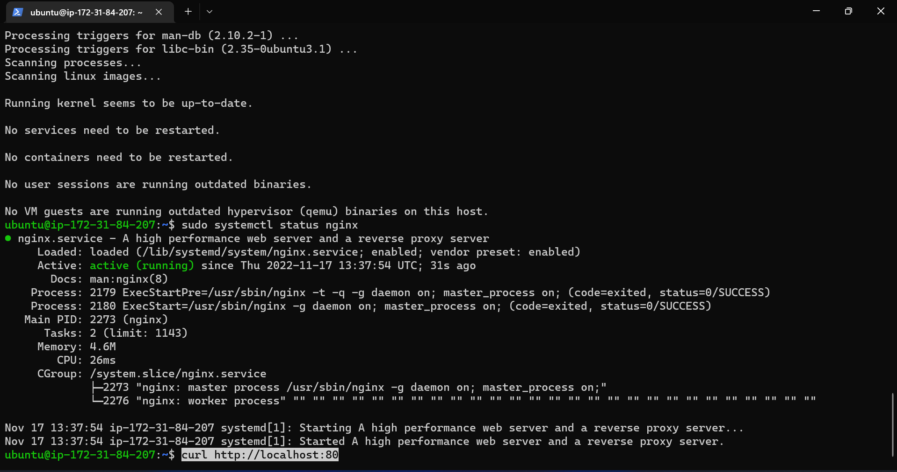
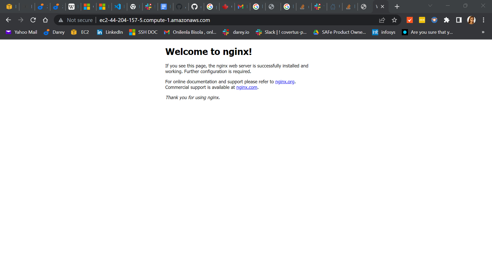
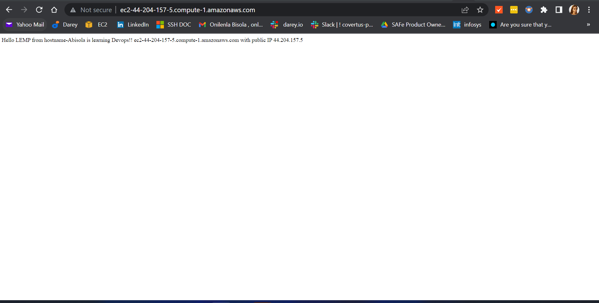
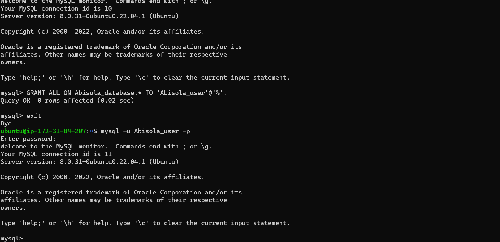
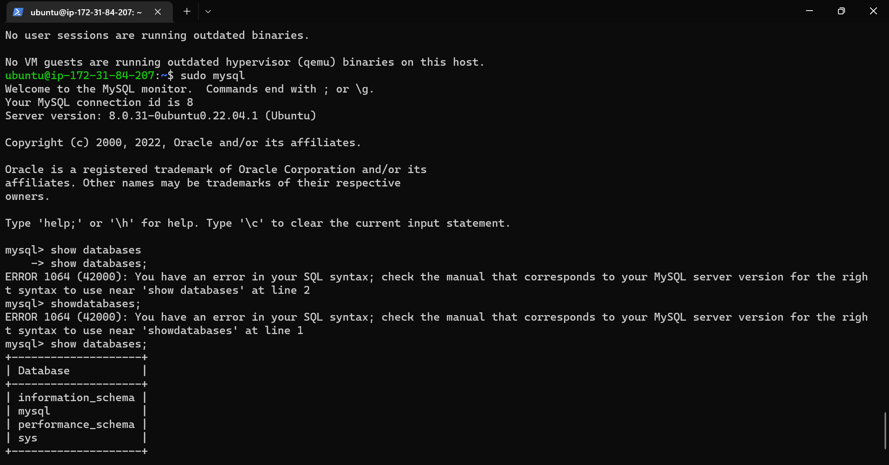
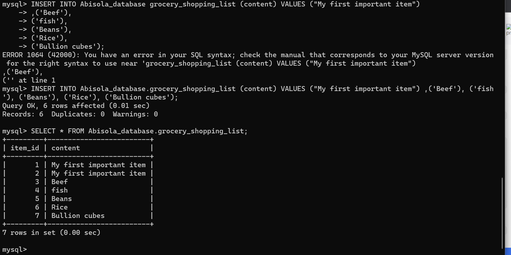
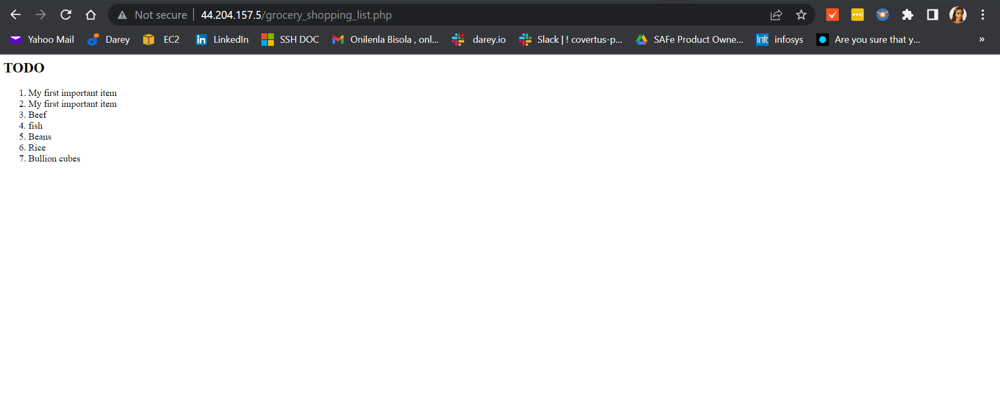

## My Documentation on Project-1
`MyNGINX_status`

`NGINX_2`

`Nginx_status`

`nginx_web_status`

`nginx_new_web_status`

`created_newuser_sql`

`Php_webserver_page`

`mysql_install_status`

`my_sql_table`

`Retrieving_data`
