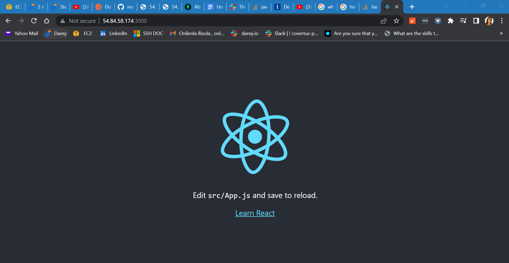
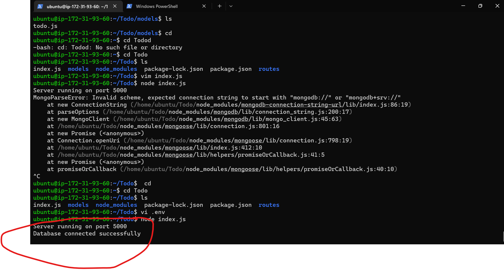
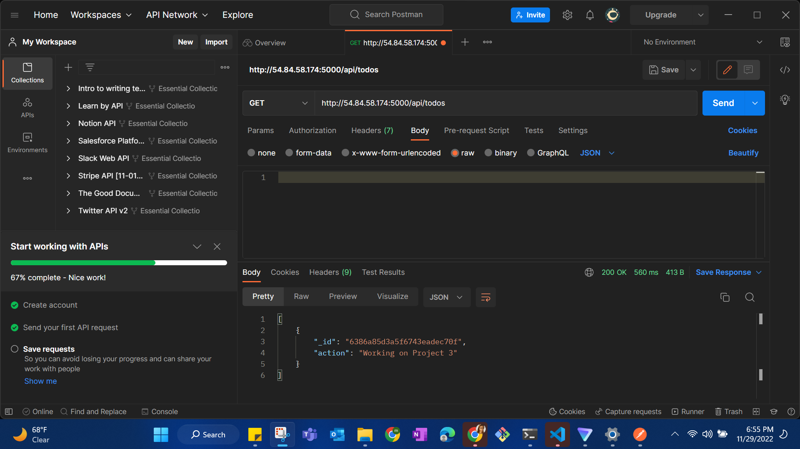
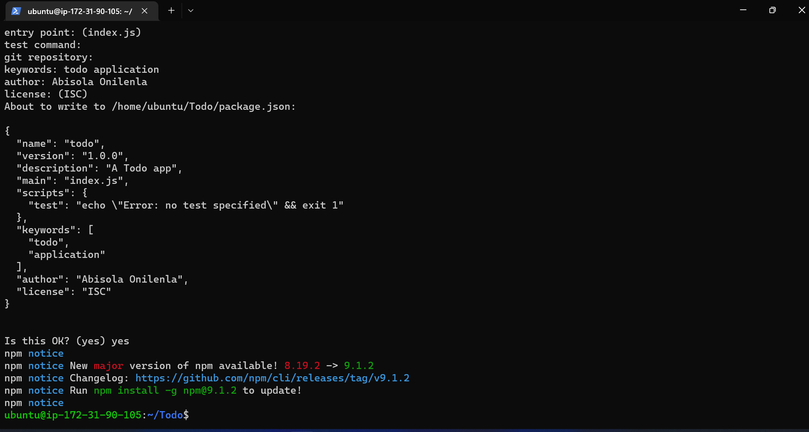
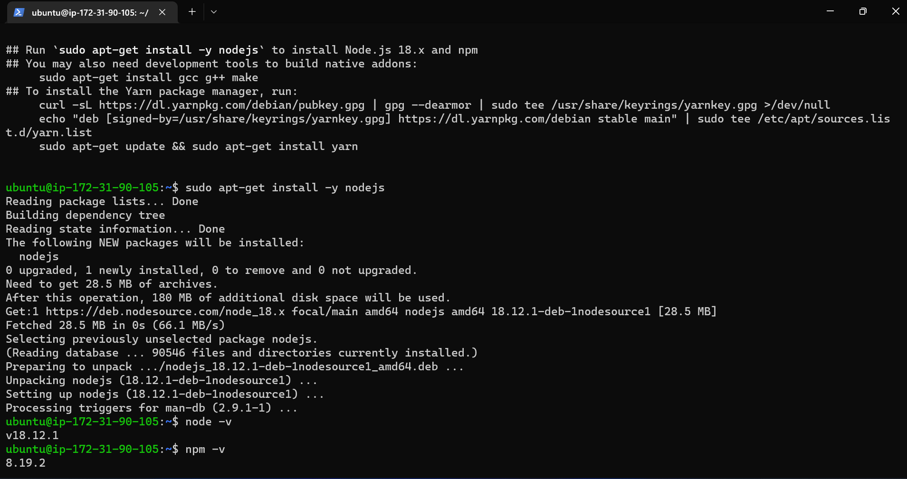
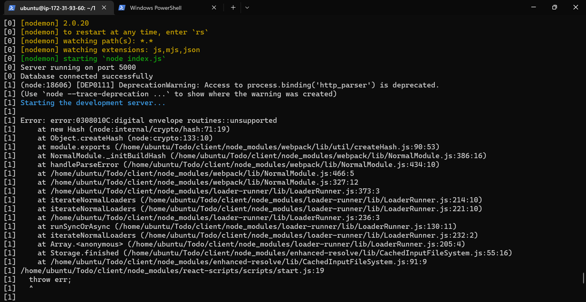
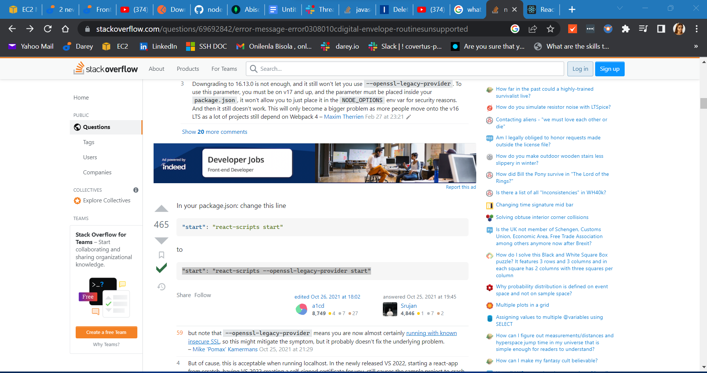
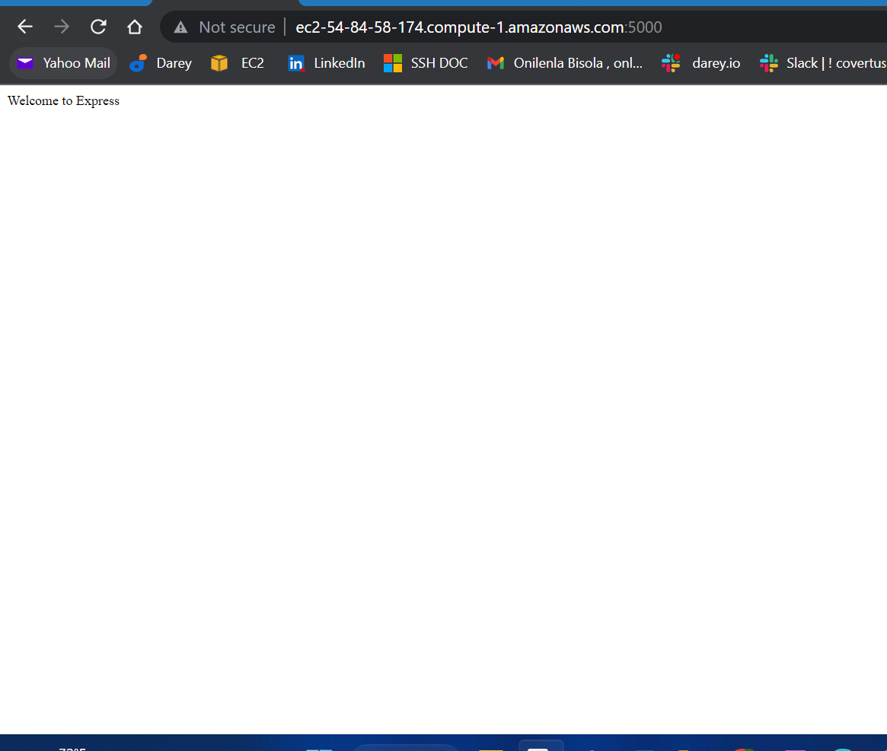
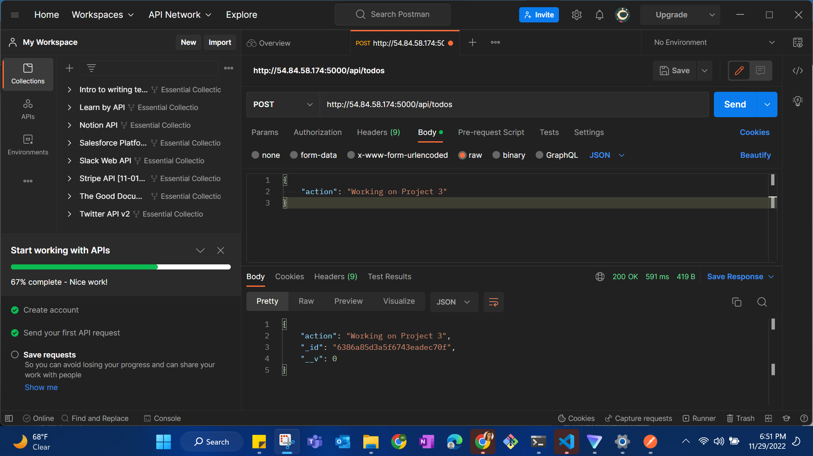
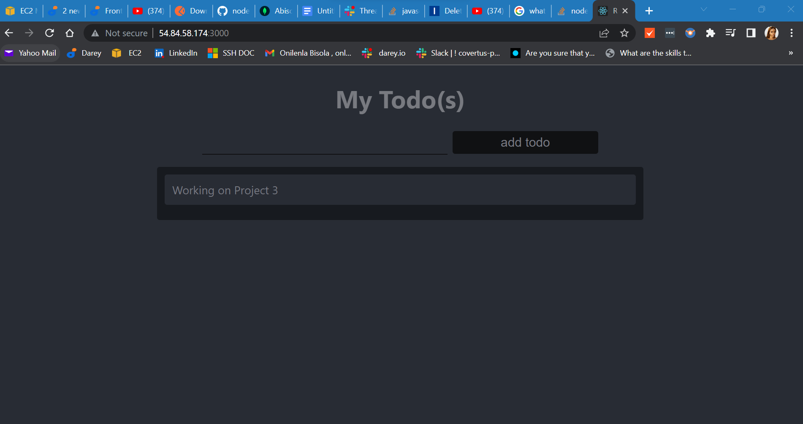

## My Documentation on Project-3
`proxy_configuration_packagejson`

`connectingtomongodb`

`GET-request-response-to-my-API`

`initializing_Todo_app_project`

`GET-request-response-to-my-API`

`Installing-Node.js`

`issue-server-npm-run-dev`

`solutiontothenpmpkg`

`startingtheserver.js`

`Testing-Backend-Code-without-Frontend-using-RESTful-API`

`To-Do-app`
